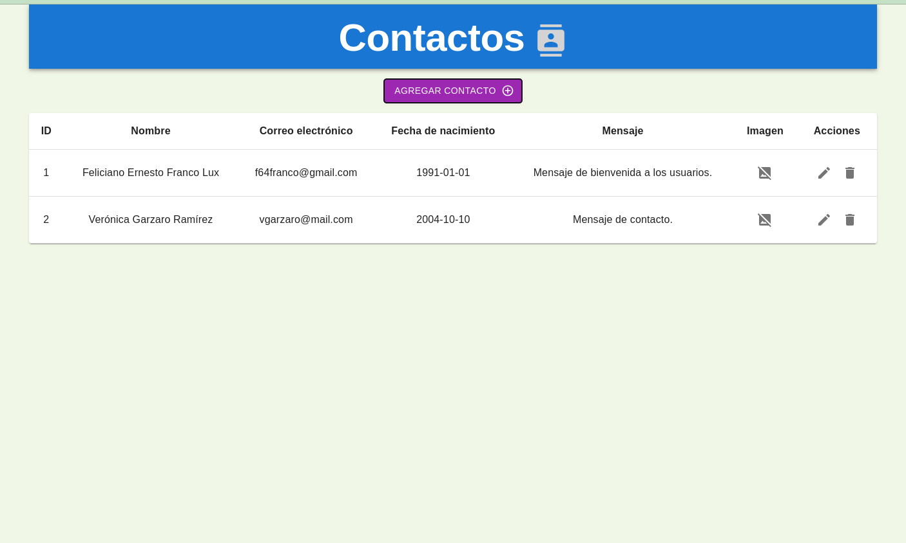
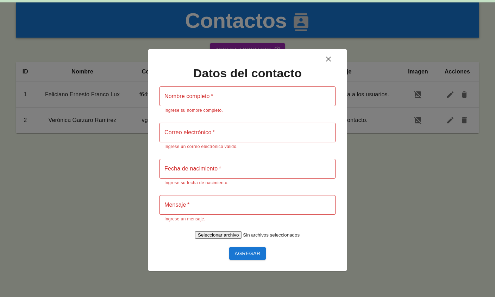

# Laravel Sail, ReactJS with Vite and MySQL

Este proyecto solicita información a través de un formulario, lo envía al backend y se almacena en la base de datos. Se utilizaron tecnologías como:

- Laravel Sail.
- React.
- Vite.
- Redux.
- Docker.
- Docker Compose.
- MySQL.
- Entre otras.

# Ejecutar el proyecto

Para ejecutar el proyecto se necesita tener instalado `Docker`, `Docker Compose`, `NodeJS` y `NPM`.

## Backend

Ingresar a la carpeta `laravel-backend`

```shell
cd laravel-backend
```

Se puede correr el api únicamente con

```shell
./vendor/bin/sail up
```

Y luego restaurar la base de datos con el comando de [`artisan migrate`](https://laravel.com/docs/master/migrations#running-migrations):

```shell
./vendor/bin/sail php artisan migrate
```

**Lo recomendable** es ejecutar ambos comandos en una sola línea de la siguiente manera

```shell
./vendor/bin/sail up -d && ./vendor/bin/sail php artisan migrate
```

Con el siguiente comando se puede visualizar el resultado de la ejecución y la URL en la que se ha publicado el servicio. La IP que se muestra en la salida de consola será la que se utilizará a la hora de levantar el frontend:

```shell
./vendor/bin/sail logs laravel.test
```

Se espera tener una salida como la siguiente:

```shell
API  | 2024-04-21 19:58:07,096 INFO Set uid to user 0 succeeded
API  | 2024-04-21 19:58:07,099 INFO supervisord started with pid 1
API  | 2024-04-21 19:58:08,103 INFO spawned: 'php' with pid 16
API  | 2024-04-21 19:58:09,105 INFO success: php entered RUNNING state, process has stayed up for > than 1 seconds (startsecs)
API  |
API  |    INFO  Server running on [http://0.0.0.0:80].
API  |
API  |   Press Ctrl+C to stop the server
API  |
```

De igual manera, para finalizar la ejecución del API se puede hacer con el siguiente comando pero eso sólo finalizará la ejecución del proyecto:

```shell
./vendor/bin/sail down
```

si se desea remover todo rastro de imagenes y volúmenes creados durante la ejecución se puede correr:

```shell
./vendor/bin/sail down --rmi all -v --remove-orphans
```

los argumentos a la derecha de `down` pertenecen a `Docker Compose` por lo que ejecutar el siguiente comando generaría el mismo resultado:

```shell
docker compose down --rmi all -v --remove-orphans
```

## Frontend

Ingresar a la carpeta `react_vite_frontend`

```shell
cd react_vite_frontend
```

Para correr el frontend se necesitará tener instalado `npm`. Instalamos las dependencias:

```shell
npm install
```

Asegurarse que dentro del proyecto se encuentre el archivo `.env` con el valor de las variables de entorno. El contenido del archivo podría ser el siguiente:

```
VITE_APP_PORT=5000
VITE_FORMS_BACKEND=http://localhost
```

La variable `VITE_FORMS_BACKEND` contiene la URL del API RESTful iniciado en la sección anterior.

Ya con los recursos completos procedemos a iniciar proyecto:

```shell
npm run dev
```

El proyecto se publicará en el puerto definido en el archivo .env, la salida esperada es la siguiente:

```shell
1:59:49 p. m. [vite] vite.config.js changed, restarting server...
1:59:49 p. m. [vite] server restarted.

  ➜  Local:   http://localhost:5000/
  ➜  Network: use --host to expose
```

### Pantalla principal



### Formulario



# Desarrollo del proyecto

## MySQL in Docker

Descargar la imagen de docker, [MySQL - Official Image](https://hub.docker.com/_/mysql), desde Docker Hub:

```shell
docker pull mysql:latest
```

Crear un contenedor con la imagen recién descargada, habilitar el puerto 3306 que es el predeterminado para MySQL:

```shell
docker run --name mysql-service -e MYSQL_ROOT_PASSWORD=PeDi6rltEhAqategas -d -p 3306:3306 mysql:latest
```

Verificar el puerto asignado al contenedor:

```shell
docker port mysql-service
```

Ingresar al contenedor con `exec`:

```shell
docker exec -it mysql-service bash
```

Se puede ingresar a MySQL con el usuario root:

```shell
mysql -u root -p
```

Se utilizarán los parámetro --host y --port para conectar al contenedor desde el `host`:

```shell
mysql --host=127.0.0.1 --port=3306 -u root -p
```

Crear la base de datos necesaria:

```shell
CREATE DATABASE basic_info;
USE basic_info;
CREATE TABLE form (name VARCHAR(100), email VARCHAR(100), birth DATE, message VARCHAR(4000), image
BLOB);
```

## Laravel

### Creación del proyecto

Para crear un proyecto Laravel se ha optado utilizar `Laravel Sail` por su facilidad de ejecución, la versatilidad de utilizar distintas versiones de PHP en un mismo equipo y la portabilidad. Según la documentación oficial de [Laravel Sail](https://laravel.com/docs/11.x/sail), _es una interfaz de línea de comandos liviana para interactuar con el entorno de desarrollo Docker de Laravel_. Como el entorno de desarrollo se encuentra en Linux se utilizará la guía [Sail on Linux](https://laravel.com/docs/11.x/installation#sail-on-linux):

Definir el contexto de Docker que se utilizará

```shell
docker context use default
```

Crear un nuevo proyecto

```shell
curl -s https://laravel.build/laravel-backend?with=mysql | bash
```

Al finalizar la ejecución del comando se podrá ver un proyecto con todos los recursos necesarios. Con esto tenemos una versión preliminar del proyecto de backend base.

### Cambios al proyecto

Para crear un API con el proyecto Laravel con Sail primero ingresamos a la carpeta `laravel-backend`

```shell
cd laravel-backend
```

Antes de cualquier modificación en el código se modificará el archivo el [docker-compose.yml](./laravel-backend/docker-compose.yml) para que tenga una configuración de MySQL como en la sección [MySQL in Docker](#mysql-in-docker), y se modificarán las credenciales de la base de datos que se encuentran en el archivo [.env](./laravel-backend/.env). Luego de las modificaciones anteriores procedemos a crear un modelo para la tabla `Form` de la base de datos:

```shell
./vendor/bin/sail artisan make:model Form --migration
```

La ejecución del comando anterior creó el archivo [Form.php](./laravel-backend/app/Models/Form.php) y el archivo de migración [2024_04_20_161015_create_forms_table.php](./laravel-backend/database/migrations/2024_04_20_161015_create_forms_table.php).

Ahora se corresponde crear un Controlador para la definición de las funciones del API Rest:

```shell
./vendor/bin/sail artisan make:controller FormController
```

Se creó el archivo [FormController.php](./laravel-backend/app/Http/Controllers/FormController.php). Crear una API, será la que recibirá las peticiones HTTP del backend:

```shell
./vendor/bin/sail php artisan install:api
```

Se creó el archivo [api.php](./laravel-backend/routes/api.php) y otros archivos de migración.

## ReactJs y Vite

Vite es una herramienta de frontend que permite generar entregables óptimos y reducidos de un sistema web para producción; no solo es un _empaquetador_, también contiene herramientas de compilación como [SWC](https://github.com/swc-project/swc). Se pueden encontrar más detalles en su [documentación oficial](https://vitejs.dev/guide/why.html).

### Creación del proyecto

Creamos nuestro proyecto de frontend con el siguiente comando:

```shell
$ npm init vite@latest
✔ Project name: … react_vite_frontend
✔ Select a framework: › React
✔ Select a variant: › JavaScript + SWC
```

Ingresamos a la carpeta recién creada e instalamos Redux y Material UI:

```shell
$ cd react_vite_frontend
$ npm install @reduxjs/toolkit react-redux @mui/icons-material @mui/material @emotion/styled @emotion/react
```

Utilizaremos los estados de la aplicación principalmente en Redux, el hook de react `useState` también se podría utilizar pero por orden y centralización se prefirió Redux. Y se utiliza `@reduxjs/toolkit` por la [simplicidad](https://redux-toolkit.js.org/introduction/getting-started). También se utilizarán los componentes de [Material UI](https://mui.com/material-ui/) e iconos.

### Cambios al proyecto

#### Archivo de configuración `configurations.js`

Si las variables de entorno se utilizan de forma regada, no podremos tener visible **_todas_** las variables de entorno que tiene el proyecto, esto porque el archivo `.env` regularmente no se encuentra en el repositorio. Lo que haremos es crear un archivo _intermedio_ que importará todas las variables de entorno y desde ahí si se podrán exportar al código fuente, éste archivo servirá como referencia para generar nuestro propio `.env`de forma local.

Crear la carpeta de configuración

```shell
$ cd src
$ mkdir config
```

Creamos el archivo `configurations.js` en la carpeta _config_

```shell
$ touch config/configurations.js
```

Se utiliza la sintaxis de los módulos ES para exportar los valores. El contenido inicial del archivo será:

```js
export default {
  APP_PORT: import.meta.env.VITE_APP_PORT,
  FORMS_BACKEND: import.meta.env.VITE_FORMS_BACKEND,
};
```

Para definir otro **puerto** de publicación es necesario agregarlo en el archivo de configuración [vite.config.js](./react_vite_frontend/vite.config.js). La configuración quedará así:

```js
import { defineConfig, loadEnv } from "vite";
import react from "@vitejs/plugin-react-swc";

// https://vitejs.dev/config/
export default defineConfig(({ mode }) => {
  process.env = { ...process.env, ...loadEnv(mode, process.cwd()) };
  return {
    plugins: [react()],
    server: {
      port: parseInt(process.env.VITE_APP_PORT),
    },
  };
});
```

#### Configuración de Redux

Crear la carpeta `store` que contendrá la configuración y estados de la aplicación:

```shell
$ cd src
$ mkdir store
```

Creamos el archivo `index.js` en la carpeta _store_

```shell
touch index.js
```

El contenido inicial del archivo será:

```js
import { configureStore } from "@reduxjs/toolkit";

export const store = configureStore({});
```

La versión final del archivo se encuentra en [./react_vite_frontend/src/store/index.js](./react_vite_frontend/src/store/index.js).

Asociamos el `store` a la raíz del proyecto, eso quiere decir que se crea un nuevo componente raíz, `<Provider />`, en la estructura principal definida en el archivo [`main.jsx`](./react_vite_frontend/src/main.jsx).

```js
import React from "react";
import ReactDOM from "react-dom/client";
import App from "./App.jsx";
import "./index.css";
import { store } from "./store/index.js";
import { Provider } from "react-redux";

ReactDOM.createRoot(document.getElementById("root")).render(
  <React.StrictMode>
    <Provider store={store}>
      <App />
    </Provider>
  </React.StrictMode>
);
```

Las llamadas hacia el API RESTful y el manejo de estados de _formularios_ se hará en el archivo [./react_vite_frontend/src/store/Forms/index.js](./react_vite_frontend/src/store/Forms/index.js).

#### Componentes

Crear la carpeta de componentes

```shell
$ cd src
$ mkdir components
```

Dentro de la carpeta `components` se encontrarán los componentes ordenados de acuerdo a los módulos que requiera el negocio. Para este caso solo se tendrá la carpeta `Forms` con el formulario y el listado de formularios.

```shell
$ cd components
$ mkdir Forms
```

Dentro de la carpeta Forms estarán el componente [`Form.jsx`](./react_vite_frontend/src/components/Forms/Form.jsx) y [`FormList.jsx`](./react_vite_frontend/src/components/Forms/FormList.jsx) que serán los que se mostrarán en el componente principal, [App.jsx](./react_vite_frontend/src/App.jsx).

# Notas

El comando `build` del propio Sail es necesario ejecutarlo cada vez que se hacen cambios en el docker-compose.yml

```shell
./vendor/bin/sail build
```

## Sobre el frontend

El proyecto de ReactJS con Vite también se puede empaquetar en una imagen de Docker, dentro de la carpeta del proyecto se encuentra el [Dockerfile](./react_vite_frontend/Dockerfile) con los detalles de la nueva imagen.

Ingresar a la carpeta `react_vite_frontend`

```shell
cd react_vite_frontend
```

Antes de crear la imagen se deben instalar las dependencias:

```shell
npm install
```

Asegurarse que dentro se encuentre el archivo .env con los valores del servicio al que apuntará. Este paso es importante para que la creación de la imagen puesto que ya quedará configurada esa variable en el empaquetado final.

```
VITE_APP_PORT=5000
VITE_FORMS_BACKEND=http://localhost
```

Construir el empaquetado final:

```shell
npm run build
```

Crear la imagen

```shell
docker build --tag frontend .
```

Crear un contenedor con la nueva imagen

```shell
docker run --name web -p 8080:80 frontend
```

Se utilizó el puerto `8080` porque el 80 regularmente esta ocupado por otro servicio, si esta libre se puede omitir el argumento `-p 8080:80` o modificarlo a un puerto disponible.

# Referencias

- [How to Set Up and Configure MySQL in Docker](https://www.datacamp.com/tutorial/set-up-and-configure-mysql-in-docker)
- [6.2.4 Connecting to the MySQL Server Using Command Options](https://dev.mysql.com/doc/refman/8.0/en/connecting.html)
- [Eloquent: API Resources](https://laravel.com/docs/11.x/eloquent-resources)
- [Laravel Installation - Docker Compose](https://laravel.com/docs/11.x/installation#sail-on-linux)
- [Guía de Laravel Sail](https://desarrolloweb.com/articulos/laravel-sail)
- [Available Column Types](https://laravel.com/docs/9.x/migrations?source=post_page-----80a516abdba1--------------------------------#available-column-types)
- [Laravel CSRF Protection Guide](https://www.stackhawk.com/blog/laravel-csrf-protection-guide/)
- [Validation](https://laravel.com/docs/11.x/validation)
